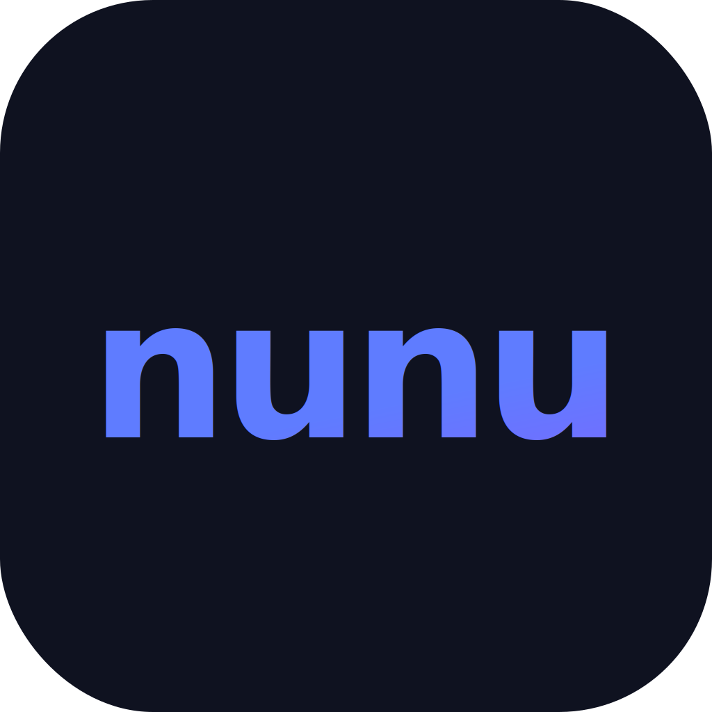

<p align="center">
  
</p>

# nunu — Android without compromise

Run Android games natively on your Mac or Windows PC. nunu handles everything — downloading the Android engine, configuring device certification, and giving you a game library to install and launch titles directly.

---

## Download

Head to [Releases](https://github.com/wisnuub/nunu/releases) and grab the latest build for your platform:

| Platform | File | Notes |
|---|---|---|
| macOS (Apple Silicon) | `nunu-x.x.x.dmg` | Open, drag to Applications, right-click → Open on first launch |
| Windows (x64) | `nunu Setup x.x.x.exe` | Run the installer; click "More info → Run anyway" if SmartScreen appears |

---

## Features

- **Guided setup** — first launch walks you through downloading the Android engine and configuring everything automatically
- **Device certification** — sets up Google Play compatibility so certified apps work out of the box
- **Game library** — browse, install, and launch popular Android games from one place
- **Google account** — sign in to sync saves and purchases across devices
- **Smart updates** — Android engine updates download as small delta patches rather than full images

---

## Build from source

**Requirements:** Node.js 20+, npm, Git

```bash
git clone https://github.com/wisnuub/nunu
cd nunu
npm install
```

**Development:**
```bash
npm run electron:dev
```

**Package for release:**
```bash
npm run electron:build:mac    # → release/nunu-x.x.x.dmg
npm run electron:build:win    # → release/nunu Setup x.x.x.exe
```

---

## Architecture

```
nunu (this repo)                  AVM (engine backend)
────────────────────────          ─────────────────────────────
Electron + React launcher   ←──── C++ hypervisor + GPU + input
UpdateService (TS)          ←──── GitHub releases / update-manifest.json
PatchService (TS)           ←──── xdelta3 delta patches
SafetyNetService (TS)       ←──── ADB device fingerprint + GMS setup
InstallationService (TS)    ←──── ADB + QEMU lifecycle
```

**First launch** runs the full onboarding flow: download → device certification → Google Sign-In.  
**Every launch after that** goes straight to your game library — no setup screens.

### Update / patch system

AVM publishes an `update-manifest.json` asset in each GitHub release. nunu checks this on startup and in Settings → Android Engine. If you already have a base image installed, it downloads only a delta patch (xdelta3 format) — typically 30–100× smaller than a full image.

For patch support, install xdelta3:
```bash
# macOS
brew install xdelta

# Windows — add xdelta3.exe to PATH
```
If xdelta3 is not available, nunu falls back to a full image download automatically.

### Google Sign-In setup (for developers)

Replace the placeholder `clientID` in [electron/services/InstallationService.ts](electron/services/InstallationService.ts) and the webview URL in [src/views/Onboarding/SignInStep.tsx](src/views/Onboarding/SignInStep.tsx) with your OAuth 2.0 client ID from Google Cloud Console. Register `nunu://oauth` as an authorized redirect URI.

---

## Data location

All runtime data lives in `~/.nunu/`:

| File | Purpose |
|---|---|
| `avm-core` | AVM engine marker |
| `android-<version>-arm64.img` | Android disk image |
| `android-version.txt` | Installed version string |
